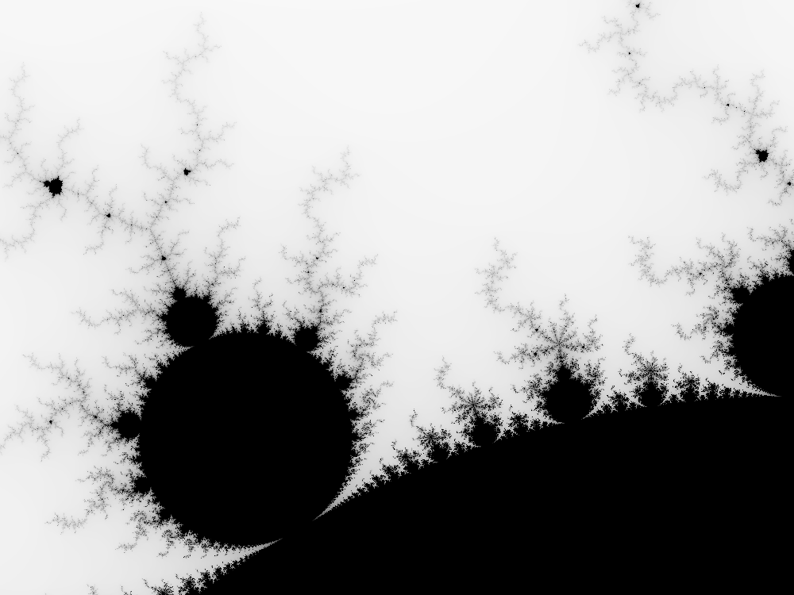

# rust-fractals
Rendering Fractal images with Rust for fun &amp; learning

### Mandelbrot

First implemented, produces a PNG with a mandelbrot set in grayscale, run like so:

	cargo run mandel.png 1000x750 -1.20,0.35 -1,0.20 

where,   

mandel.png -> Name of the output file  
1000x750 -> Image size in pixels  
-1.20,0.35 -> Upper left boundary of complex number space  
-1,0.20 -> Lower right boundary of complex number space  

Result:

  